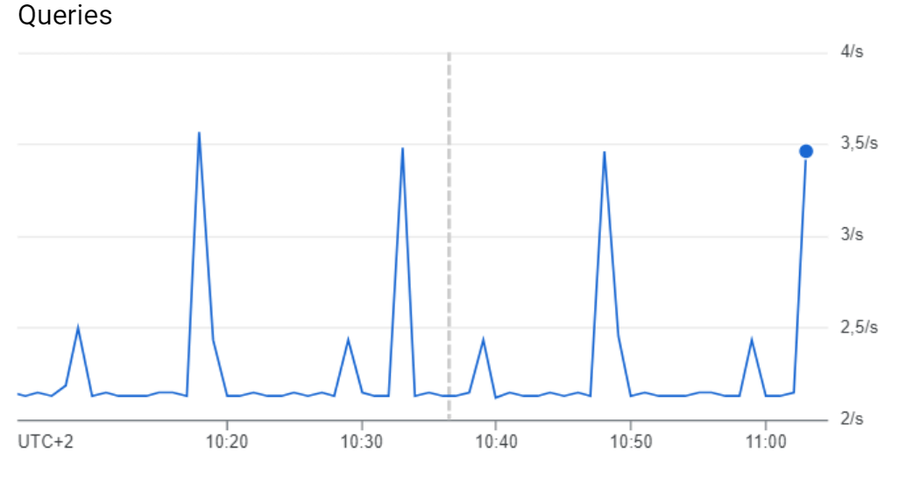
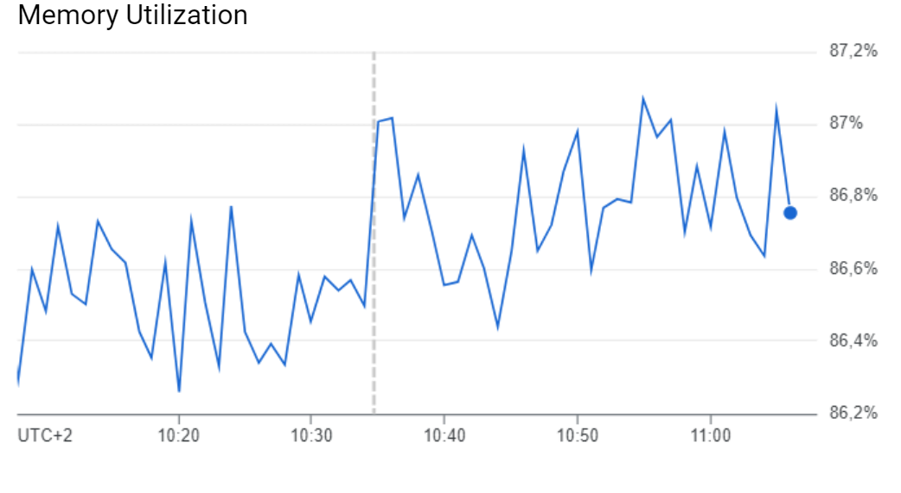
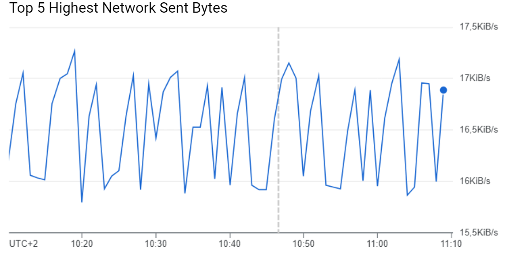
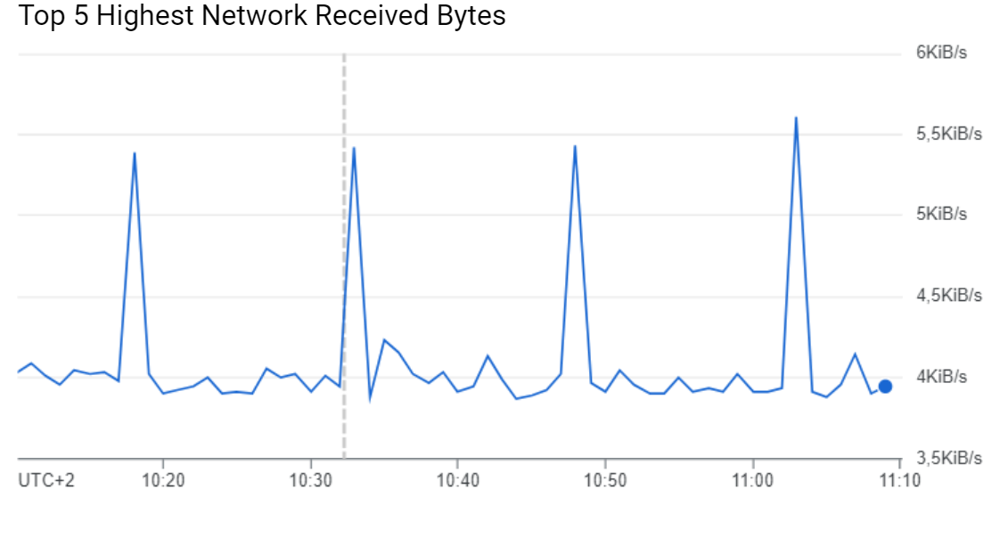

<a name="readme-top"></a>
# GCP_Terraform

# Analisi 

In questo progetto ho usato GCP per realizzare il deploy di un'applicazione web creata precedentemente chiamata <a href="https://github.com/Marawan89/Astra">Astra</a>. 
Astra è una web app che contiene i servizi essenziali presenti nel sito di un hotel (prenotazione stanza, recensioni, gestione delle prenotazioni eseguite e delle recensioni scritte ecc...).
Questo è uno schema architetturale del progetto:

<div align="center">
  <a href="https://github.com/Marawan89/GCP_Terraform">
    
  </a>
</div>

# Passaggi
Questo è l'elenco di tutto il necessario per eseguire il deploy di un'applicazione web; in seguito analizzeremo ogni punto
<summary>Indice:</summary>
<ol>
  <li><a href="#Container">Container</a></li>
    <ul>
      <li><a href="#dockerFile">dockerFile</a></li>
      <li><a href="#dockerBuild">dockerBuild</a></li>
      <li><a href="#dockerRun">dockerRun</a></li>
    </ul>
  <li><a href="#Database">Database</a></li>
    <ul>
      <li><a href="#Instance">Instance</a></li>
      <li><a href="#serviceUser">serviceUser</a></li>
    </ul>
  <li><a href="#GCR">GCR</a></li>
  <li><a href="#GCB">GCB</a></li>
  <li><a href="#Dashboard">Dashboard</a></li>
  <li><a href="#Contatti">Contatti</a></li>
</ol>


## Container

### dockerFile
Il docker file è quello che ci darà la possibilità di inserire in un container il codice dell'applicazione web.\
La prima cosa che ho fatto è stata creare questo File e inserirlo all'interno della repository del mio sito web.

### dockerBuild
Una volta creato il file c'è bisogno di eseguire i seguenti comandi in modo da creare un container e pusharlo sul Container Registry di Google:
   ```yml
   # Creare un container
   docker build -t "NOME IMMAGINE"
   
   # Taggare l'immagine 
   docker tag "NOME IMMAGINE" gcr.io/"ID PROGETTO"/"NOME IMMAGINE"[:TAG]

   # Autenticarsi con il comando
   gcloud auth login

   # Pushare l'immagine
   docker push gcr.io/"ID PROGETTO"/"NOME IMMAGINE"[:TAG]
   ```

### dockerRun
Infine occorre eseguire il comando che lancerà il container e renderà il sito visualizzabile nella porta specificata:
```yml
  docker run -p "NUMERO PORTA:NUMERO PORTA" --name NOME IMMAGINE

```
<p align="right">(<a href="#readme-top">back to top</a>)</p>


## Database
Questo progetto è stato realizzato utilizzando la piattaforma di Google Cloud ma è tutto automatizzato da terraform, un linguaggio HCL. La parte di database che comprende la creazione dell'istanza e del service db user è all'interno del file main.tf

### Instance
E' stata creata l'istanza del db utilizzando la risorsa di terraform google_sql_database_instance ed è stata nominata astra_dbinstance e allocata a una region specifica.

### serviceUser
E' stata creata una risorsa google_sql_user per gestire l'autenticazione del service_db_user, che sono gli utenti utilizzati dalla applicazione web per accedere al database.

<p align="right">(<a href="#readme-top">back to top</a>)</p>

## GCR

Sempre utilizzando terraform per automatizzare tutti gli aspetti di Google Cloud Run ho usato la risorsa di google_cloud_run_v2_service specificando il provider google-beta perchè supporta tante funzionalità di GCP che altri provider (come google) non supportano.
Nel blocco containers ho specificato l'immagine astraimage da utilizzare per il servizio, perchè contiene la nostra web app dove impostavo le variabili di ambiente che verranno usate per accedere al database.\
Nel blocco resources sono settati i limiti delle risorse CPU e memoria. 
<p align="right">(<a href="#readme-top">back to top</a>)</p>

## GCB

Il progetto include anche le pipeline CI/CD in modo tale da accelerare il rilascio delle modifiche e automatizzare il processo di sviluppo, test e distribuzione.
Questa parte del progetto è gestita da Google Cloud Build che aggiorna l'immagine del container ad ogni commit che viene pushato all'interno della repository.\
Per prima cosa ho creato un file chiamato cloudbuild.yaml (da sintassi) che sarà il file che Google Cloud Build utilizzerà per la compilazione. 
Ho creato un trigger chiamato AstraTrigger che si attiva quando si effettua uno specifico evento (push al ramo). Ho quindi specificato tutti i dati della repository github in modo tale che il trigger possa avere accesso, e che possa visualizzare ogni commit in autonomia e aggiornare l'immagine del container.

<p align="right">(<a href="#readme-top">back to top</a>)</p>

## Dashboard

Questi sono i grafici che ho usato per per monitorare le parti più essenziali del mio progetto:-

### Queries

<div align="center">
  <a href="https://github.com/Marawan89/GCP_Terraform">
    
  </a>
</div>

### CPU Utilization

<div align="center">
  <a href="https://github.com/Marawan89/GCP_Terraform">
    
  </a>
</div>

### Memory Utilization

<div align="center">
  <a href="https://github.com/Marawan89/GCP_Terraform">
    
  </a>
</div>

### Top 5 Highest Network Sent Bytes

<div align="center">
  <a href="https://github.com/Marawan89/GCP_Terraform">
    
  </a>
</div>

### Top 5 Highest Network Received Bytes

<div align="center">
  <a href="https://github.com/Marawan89/GCP_Terraform">
    
  </a>
</div>

## Contatti

Marawan Emad - marawan.emadragab@studio.unibo.it <br />


Project Link: [https://github.com/Marawan89/GCP_Terraform](https://github.com/Marawan89/GCP_Terraform)

<p align="right">(<a href="#readme-top">back to top</a>)</p>
